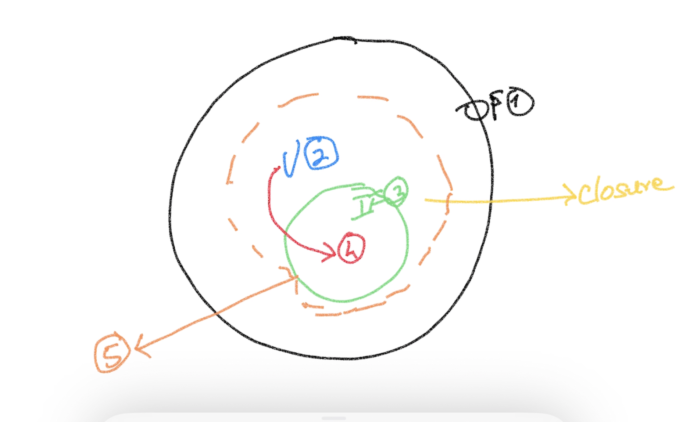

# Closures

## Steps for creating a closure
- **Step:1** Create an outer function
- **Step:2** Declare a variable in the outer function
- **Step:3** Create an inner function
- **Step:4** Refer the variable of the outer function in the inncer function
- **Step:5** Extend the lifetime of the inner function beyond the lifetime of the outer function (and thereby the lifetime of the variable is also extended beyond the outer function)

