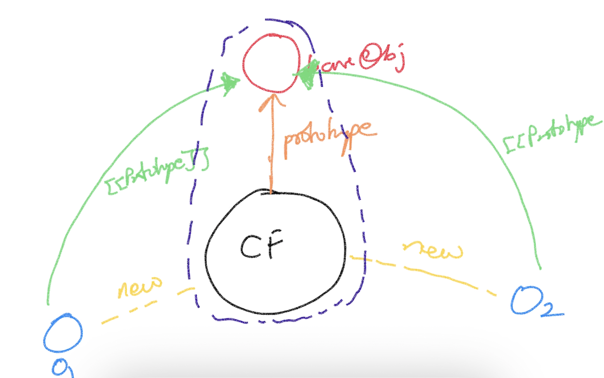

# Inheritence in JS

## Prototypal Inheritence
- One object is used as a base object for a family of objects
- The relationship with the base object is maintained using an hidden attribute "[[Prototype]]"



```
function Product(id, name, cost){
    //this => new object
    this.id = id
    this.name = name
    this.cost = cost
    // this => returned by default
}
Product.prototype.display = function(){
    console.log(this.id, this.name, this.cost)
}
```